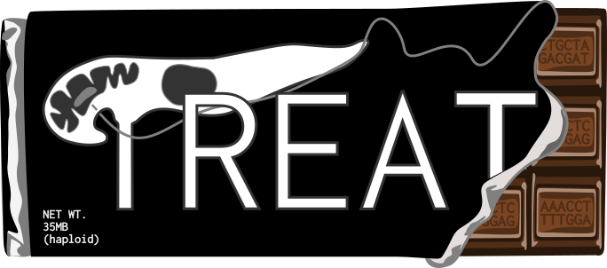
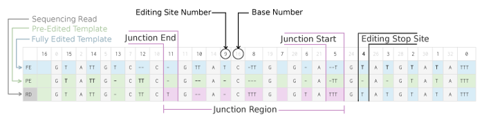
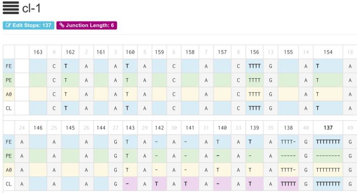

===============================================================================
Trypanosome RNA Editing Alignment Tool
===============================================================================

------------------------------------------------------------------------
What is TREAT?
------------------------------------------------------------------------

TREAT is a multiple sequence alignment and visualization tool specifically
designed to analyze variation in sequences caused by Uridine insertion/deletion
RNA editing. This phenomenon occurs in trypanosomes, a group of unicellular
parasitic flagellate protozoa such the subspecies of Trypanosoma brucei which
are the causative agents of Human African Trypanosomiasis (HAT or African
Sleeping Sickness). The pre-mRNA sequences in trypanosomes are
posttranscriptionally edited by the insertion/deletion of uridylate residues.
TREAT aligns sequences using three bases and assembles editing sites to detect
the extent of editing of the fourth base, called the edit base. The edit base
is configurable in TREAT and by default uses 'T'. TREAT is written in Go and is
released under the GPLv3 free software license. 

------------------------------------------------------------------------
Installation
------------------------------------------------------------------------

Download the latest binary release for your system `here <https://github.com/ubccr/treat/releases>`_.
Extract the zip file::

  $ unzip treat-0.0.x.zip
  $ cd treat-0.0.x
  $ ./treat --help

------------------------------------------------------------------------
Simple Alignment
------------------------------------------------------------------------

TREAT can perform a global alignment between two arbitrary sequences detecting
the amount of insertion/deletions (indels) of a single base (called the "edit
base"). The default edit base in TREAT is "T". For example::

  $ ./treat align -1 ATCTGTATGT -2 ATTCGATTG -b T
  A-TCTGTA-TGT
  ATTC-G-ATTG-

------------------------------------------------------------------------
Alignment with Templates
------------------------------------------------------------------------

TREAT can perform global alignments using template sequences.  TREAT requires
two user provided template sequences: fully edited and pre-edited. The fully
edited template represents a mature edited mRNA transcript (completely
precisely edited mRNA). The pre-edited template represents the sequence that
will be edited in the mature RNA. TREAT accepts input sequences in FASTA
format. For example::

  # simple-templates.fa
  >Fully Edited
  CTTAATACACTTTTGATTAACAAACTTTAAA
  >Pre-Edited
  CTAATTACACTTTGATAACAAACTAAA

  # simple-sequences.fa
  >example-1
  CTTAATTACACTTTGATTAACAAACTTTAAA

Save the above sequence files and run the alignment using TREAT. The example
sequences can also be found in the ./examples directory::

  $ ./treat align -t simple-templates.fa -f simple-sequences.fa
  ================================================================================
  example-1
  ================================================================================
  JSS: 12
  ESS: 11
  JES: 18
  Junc Len: 7
  ================================================================================

  FE: CTTAA-TACACTTTTGATTAACAAACTTTAAA
  PE: C-TAATTACAC-TTTGA-TAACAAAC--TAAA
  RD: CTTAATTACAC-TTTGATTAACAAACTTTAAA

TREAT computes the extent of canonical editing and reports various
editing site characteristics as shown below:

------------------------------------------------------------------------
Large Scale Alignment Analysis
------------------------------------------------------------------------

TREAT can optionally store alignments into a database for more complex
analysis, searching, and viewing in a web browser. TREAT has been tested on
RNA-Seq data containing millions of sequences reads. Here's an example using
sequences from ribosomal protein S12 (RPS12) from Trypanosoma brucei
mitochondria. 

TREAT accepts sequencing data in FASTA format. An example FASTA file
(templates.fasta) containing the Fully Edited, Pre-Edited and one alternatively
Edited template sequences is shown below::

  >RPS12-FE Fully Edited
  CTAATACACTTTTGATAACAAACTAAAGTAAAtAtAttttGttttttttGCGtAtGtGAT
  TTTTGtAtGGttGttGtttACGttttGttttAtttGttttAtGttAttAtAtGAGtCCGC
  GAttGCCCAGttCCGGtAACCGACGtGtAttGtAtGCCGtAttttAttTAtAtAAttttG
  tttGGAtGttGCGttGttttttttGttGttttAttGGtttAGttAtGTCAttAtttAttA
  tAGAGGGTGGtGGttttGttGAtttACCCGGtGTAAAGtAttAtACACGTAttGtAAGtt
  AGATTTAGAtATAAGATATGTTTTT
  >RPS12-PE Pre-Edited
  CTAATACACTTTTGATAACAAACTAAAGTAAAAAGGCGAGGATTTTTTGAGTGGGACTGG
  AGAGAAAGAGCCGTTCGAGCCCAGCCGGAACCGACGGAGAGCTTCTTTTGAATAAAAGGG
  AGGCGGGGAGGAGAGTTTCAAAAAGATTTGGGTGGGGGGAACCCTTTGTTTTGGTTAAAG
  AAACATCGTTTAGAAGAGATTTTAGAATAAGATATGTTTTT
  >RPS12-A0 Alternative Editing (Cruz-Reyes 2013) alt_start=27 alt_stop=34
  CTAATACACTTTTGATAACAAACTAAAGTAAAtAtAttttGttttttttGCGtAtGtGAT
  TTTTGtAtGGttGttGtttACGttttGttttAtttGttttAtGttAttAtAtGAGtCCGC
  GAttGCCCAGttCCGGtAACCGACGtGtAttGtAtGCCGtAttttAttTAtAtAAttttG
  tttGGAtGttGCGttGttttttttGttGttttAttGGtttAGttAtGTCAttAtttAttA
  tAGAGGGTGGtGGttttGttGAtttACCtCGttGGttTAtAtAGtAttAtACACGTAttG
  tAAGttAGATTTAGAtATAAGATATGTTTTT

FASTA file with our DNA fragment reads (sample-1.fasta)::

  >1-10
  CTAATACACTTTTGATAACAAACTAAAGATATAATATTTTTGTTTTTTTTGCGTATGTGA
  TTTTTGTATGGTTGTTGTTTACGTTTTGTTTTATTTGTTTTATGTTATTATATGAGTCCG
  CGATTGCCCAGTTCCGGTAACCGACGTGTATTGTATGCCGTATTTTATTTATATAATTTT
  GTTTGGATGTTGCGTTGTTTTTTTTGTTGTTTTATTGGTTTAGTTATGTCATTATTTATT
  ATAGAGGGTGGTGGTTTTGTTGATTTACCCGGTGTAAAGTATTATACACGTATTGTAAGT
  TAGATTTAGATATAAGATATGTTTTT
  >2-9
  CTAATACACTTTTGATAACAAACTAAAGTAAAAAGGCGAGGATTTTTTGAGTGGGATTCGGT
  ATTTGTTTTATGTTATTATATGAGTCCGCGATTGCCCAGCTCTGGTAACCGACGTGTATTGT
  ATGCCGTATTTTATTTATATAATTTTGTTTGGATGTTGCGTTGTTTTTTTTGTTGTTTTATT
  GGTTTAGTTATGTCATTATTTATTATAGAGGGTGGTGGTTTTGTTGATTTACCCGGTGTAAA
  GTATTATACACGTATTGTAAGTTAGATTTAGATATAAGATATGTTTTT
  >3-120
  CTAATACACTTTTGATAACAAACTAAAGTAAAAAGGCGAGGATTTTTTGAGTGGGATTCGGTA
  TTTGTTTTATGTTATTATATGAGTCCGCGATTGCCCAGCTCTGGTAACCGACGTGTATTGTAT
  GCCGTATTTTATTTATATAATTTTGTTTGGATGTTGCGTTGTTTTTTTTGTTGTTTTATTGGT
  TTAGTTATGTCATTATTTATTATAGAGGGTGGTGGTTTTGTTGATTTACCCGGTGTAAAGTAT
  TATACACGTATTGTAAGTTAGATTTAGATATAACATATGTTTTT

Load the sample data using TREAT::

  $ ./treat --db treat.db load --gene RPS12 \
      --fasta sample-1.fa \
      --template templates.fa \
      --offset 10 \
      --sample SampleName01 \
      --knock-down GAP1 \
      --tet \
      --replicate 1

  INFO[0000] Using template Edit Stop Site: 9
  INFO[0000] Using Edit Site numbering offset: 10
  INFO[0000] Processing fragments for sample name: SampleName01
  INFO[0000] Done. Loaded 15 fragment sequences for sample SampleName01

A new database file has been created called "treat.db".

Normalize the read counts to 100000 (or an appropriate n) using the following
command. Note: If you don't provide an n treat will normalize to the average
read count across all samples within the gene::

  $ ./treat --db testerino.db norm -n 100000
  INFO[0000] Processing gene RPS12...
  INFO[0000] Normalizing to read count: 100000.0000
  INFO[0000] Processing sample SampleName01 using normalized scaling factor: 9.3844

Search the data using the TREAT command line tool::

  $ ./treat --db treat.db search -g RPS12 -l 10 --csv
  gene,sample,norm,read_count,alt_editing,has_mutation,edit_stop,junc_end,junc_len,junc_seq
  RPS12,sample-1,10.0000,10,0,0,137,143,6,ATATAATATTTTTG
  RPS12,sample-1,9.0000,9,0,0,95,123,28,TTCGGTATTTGTTTTATGTTATTATATGAGTCCGCGATTGCCCAGCTCTG

Search options are described below::

  $ ./treat help search
  NAME:
     treat search - Search database

  USAGE:
     treat search [command options] [arguments...]

  OPTIONS:
     --gene, -g                                           Gene Name
     --sample, -s [--sample option --sample option]       One or more samples
     --edit-stop "-1"                                     Edit stop
     --junc-end "-1"                                      Junction end
     --junc-len "-1"                                      Junction len
     --alt "0"                                            Alt editing region
     --offset, -o "0"                                     offset
     --limit, -l "0"                                      limit
     --has-mutation                                       Has mutation
     --all, -a                                            Include all sequences
     --has-alt                                            Has Alternative Editing
     --csv                                                Output in csv format
     --fasta                                              Output in fasta format
     --no-header, -x                                      Exclude header from output

Start the TREAT server and view the sequences in a web browser::

  $ ./treat --db treat.db server -p 8080
  INFO[0000] Processing database: testerino.db
  INFO[0000] Computing cache for gene RPS12...
  INFO[0000] Max ESS: 21 Max JL: 12 Max JE: 21
  INFO[0000] Using template dir: ./templates
  INFO[0000] Running on http://127.0.0.1:8080

To view the TREAT web interface, point your web browser at
http://localhost:8080. By default, treat will listen on port 8080.

------------------------------------------------------------------------
Building from source
------------------------------------------------------------------------

TREAT is written in Go requires v1.11 or greater. Clone the repository::

  $ git clone https://github.com/ubccr/treat
  $ cd treat
  $ go build .

------------------------------------------------------------------------
References
------------------------------------------------------------------------

- Rachel M. Simpson, Andrew E. Bruno, Jonathan E. Bard, Michael J. Buck and
  Laurie K. Read. High-throughput sequencing of partially edited trypanosome
  mRNAs reveals barriers to editing progression and evidence for alternative
  editing. RNA, 2016. http://dx.doi.org/10.1261/rna.055160.115

------------------------------------------------------------------------
License
------------------------------------------------------------------------

TREAT is released under the GPLv3 license. See the LICENSE file. TREAT logo
designed by Nicole B. Laski. 
